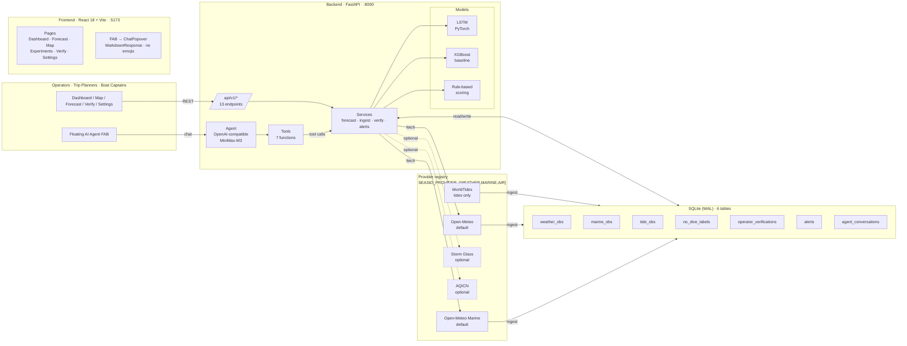

# 🌊 SeaSID — Sea Safety Intelligence Dashboard

**AI-powered dive condition forecasting** for Dauin & Apo Island, Philippines.

SeaSID combines a PyTorch **LSTM** (primary forecaster), **XGBoost** (baseline + ablation), and an LLM-powered **agent** to predict diving safety conditions from real-time weather, marine, and air-quality data. The whole thing is built around a **pluggable provider registry** — Open-Meteo is the default; Storm Glass and AQICN swap in via env vars when you want richer marine or air-quality data.

---

## 📚 Documentation map

| Doc | Purpose |
|---|---|
| `README.md` (this file) | Project description, quick start, feature vector, API surface, default dev accounts. |
| [`SECURITY.md`](SECURITY.md) | Authoritative security guide: provider-key encryption, `SEASID_AUTH_SECRET`, leak response, vulnerability reporting. |
| [`SeaSID.md`](SeaSID.md) | Original v1 spec with v1 → v2.1 drift summary, provider matrix, current auth/secret-management notes (section 0.2). |

## Architecture



The dashed boxes (Storm Glass, AQICN) are optional — when no enabled database key exists the registry returns empty data and the rest of the system keeps working with Open-Meteo only.

---

## Features

| Feature                         | Description                                                              |
| ------------------------------- | ------------------------------------------------------------------------ |
| **LSTM Forecast**         | PyTorch 2-layer LSTM, 24h sliding window, 14 features                    |
| **XGBoost Baseline**      | sklearn-compatible classifier, LeaveOneOut CV                            |
| **Rule-Based Baseline**   | Hand-tuned thresholds for cold-start (used when no model loaded)         |
| **Pluggable Providers**   | Open-Meteo (default) · Storm Glass · AQICN · WorldTides               |
| **LLM Agent**             | OpenAI-compatible (MiniMax-M3) with**7 function-calling tools**    |
| **AI Agent FAB**          | Floating chat popover on every page — markdown, no emojis               |
| **Responsive Sidebar**    | Drawer (xs/sm) · narrow rail (md) · collapsible full (lg/xl)           |
| **Settings**              | Theme switch, default site, per-tool toggles, agent-tools reference      |
| **Operator Verification** | Feedback loop for continuous model improvement                           |
| **Real-Time Alerts**      | Threshold-based (wind, rain, waves, currents) — explicit`/alerts/run` |
| **Experiment Suite**      | 4 models × 4 ablations × 5 metrics with automated plots                |
| **OSM Map**               | OpenStreetMap with P(no-go) heat-radius overlay per site                 |

---

## Quick Start

### Prerequisites

- Python 3.12+
- Node.js 18+
- An administrator account for configuring encrypted provider credentials

### 1. Backend Setup

```bash
cd backend

# Create virtual environment
python -m venv .venv
.venv/Scripts/activate           # Windows
# source .venv/bin/activate      # macOS/Linux

# Install dependencies
pip install -r requirements.txt

# Set up environment
cp .env.example .env
# Provider keys and the LLM base URL are configured after startup in
# Settings -> API keys and stored in backend/data/seasid.db.
# OPENAI_MODEL remains an optional non-secret runtime setting.

# Configure API authentication (required for protected routes)
#   SEASID_AUTH_SECRET=<random string, at least 32 characters>
#   SEASID_ADMIN_USERNAME=admin
#   SEASID_ADMIN_PASSWORD=<strong password>

# Initialize database and seed data
python -m scripts.init_db
python -m scripts.seed_history

# (Optional) Expand dataset with 90 days of historical weather
python -m scripts.expand_dataset

# (Optional) Train ML models
python -m scripts.train_model

# Start the API server
python -m scripts.run_api --reload
```

### 2. Frontend Setup

```bash
cd frontend
npm install
npm run dev   # http://localhost:5173
```

### 3. Open the Dashboard

- Frontend: http://localhost:5173
- API docs: http://localhost:8000/docs
- Health: http://localhost:8000/api/v1/health

### Authentication

SeaSID uses signed bearer tokens for protected API routes. The health check,
login endpoint, and site registry are public; forecasts, agent conversations,
operator verification, ingestion, alerts, and experiment operations require a
token. Roles are `viewer`, `operator`, `data_steward`, and `admin`; user
records may be restricted to specific site keys.

**Default credentials.** When neither `SEASID_AUTH_USERS_JSON` nor the
`SEASID_ADMIN_USERNAME`/`SEASID_ADMIN_PASSWORD` pair is set, the API boots
with the following built-in development accounts so a fresh checkout can log
in immediately. A warning is logged once on startup:

| Username         | Password        | Role          | Site scope                |
| ---------------- | --------------- | ------------- | ------------------------- |
| `admin`          | `admin-dev`     | `admin`       | `*` (all sites)           |
| `steward`        | `steward-dev`   | `data_steward`| `*` (all sites)           |
| `dauin-operator` | `operator-dev`  | `operator`    | `dauin_muck` only         |
| `reef-operator`  | `operator-dev`  | `operator`    | `apo_reef` only           |
| `viewer`         | `viewer-dev`    | `viewer`      | `*` (all sites)           |

A placeholder JWT signing secret is used in this mode. For any non-dev
deployment, configure real users via `SEASID_AUTH_USERS_JSON` and set
`SEASID_AUTH_SECRET` to a random string of at least 32 characters. Set
`SEASID_AUTH_REQUIRE_EXPLICIT_USERS=true` to disable the dev-default
fallback entirely (login attempts then return 401/503).

---

## API Endpoints (`/api/v1/...`)

| Method | Endpoint                       | Description                                       |
| ------ | ------------------------------ | ------------------------------------------------- |
| GET    | `/health`                    | DB + model status                                 |
| POST   | `/auth/login`                | Exchange credentials for a bearer token           |
| GET    | `/auth/me`                   | Inspect the current authenticated identity        |
| GET    | `/sites`                     | List registered dive sites                        |
| GET    | `/forecast?site=<key>`       | 48-hour forecast (includes optional`air` block) |
| POST   | `/ingest`                    | Pull weather + marine + air + tide data           |
| POST   | `/verify`                    | Submit operator verification                      |
| GET    | `/labels?site=<key>`         | Label history                                     |
| GET    | `/alerts?site=<key>`         | Recent alerts                                     |
| POST   | `/alerts/run`                | Trigger alert evaluation (write-side)             |
| POST   | `/agent/chat`                | Agent conversation                                |
| GET    | `/agent/briefing?site=<key>` | Auto-generated briefing                           |
| GET    | `/experiments/results`       | Experiment results                                |
| POST   | `/experiments/run`           | Run experiment suite (auto-reloads model)         |

---

## 14-Feature Vector

| #  | Feature                | Window     | Unit    | Source                | Since |
| -- | ---------------------- | ---------- | ------- | --------------------- | ----- |
| 1  | `precip_24h_mm`      | 24h sum    | mm      | Open-Meteo            | v1    |
| 2  | `precip_48h_mm`      | 48h sum    | mm      | Open-Meteo            | v1    |
| 3  | `precip_recent_3h`   | 3h sum     | mm      | Open-Meteo            | v1    |
| 4  | `wind_max_24h_kmh`   | 24h max    | km/h    | Open-Meteo            | v1    |
| 5  | `wind_mean_24h_kmh`  | 24h mean   | km/h    | Open-Meteo            | v1    |
| 6  | `wave_max_24h_m`     | 24h max    | m       | Open-Meteo Marine     | v1    |
| 7  | `sea_temp_mean_24h`  | 24h mean   | °C     | Open-Meteo Marine     | v1    |
| 8  | `tide_max_24h_m`     | 24h max    | m       | WorldTides            | v1    |
| 9  | `tide_min_24h_m`     | 24h min    | m       | WorldTides            | v1    |
| 10 | `tide_range_24h_m`   | max − min | m       | WorldTides            | v1    |
| 11 | `is_muck_site`       | static     | 0/1     | site registry         | v1    |
| 12 | `aqi_recent`         | current    | AQI     | **AQICN**       | v2.1  |
| 13 | `pm25_recent`        | current    | µg/m³ | **AQICN**       | v2.1  |
| 14 | `wave_period_s_mean` | 24h mean   | s       | **Storm Glass** | v2.1  |

Columns 1-11 are the **v2 contract**; 12-14 are the **v2.1 extension** for air-quality (AQICN) and marine augmentation (Storm Glass). When an optional provider is not configured, sensible defaults are used (0.0 for AQI/PM2.5, 6.0 s for tropical-swell wave period) so the model still works on the 11-feature baseline.

---

## Provider Registry (v2.1)

Three roles are decoupled and toggled per-role via environment variables:

| Role                                   | Default        | Optional       | Env var                     |
| -------------------------------------- | -------------- | -------------- | --------------------------- |
| `weather` — surface weather         | `open_meteo` | —             | `SEASID_PROVIDER_WEATHER` |
| `marine` — wave, swell, currents    | `open_meteo` | `stormglass` | `SEASID_PROVIDER_MARINE`  |
| `air` — AQI, PM2.5, PM10, O₃, NO₂ | `off`        | `aqicn`      | `SEASID_PROVIDER_AIR`     |

Each provider is also honouring per-site opt-out via the `air_provider_disabled` site flag (set when the nearest AQICN station is > 500 km away — the free tier would return meaningless distant data).

| Provider                                    | Free tier         | Credential setup       |
| ------------------------------------------- | ----------------- | ---------------------- |
| **Open-Meteo** (weather + marine)     | unlimited, no key | none                   |
| **Storm Glass** (marine augmentation) | 50 req/day        | Settings → API keys    |
| **AQICN** (air quality)               | 1000 req/day      | Settings → API keys    |
| **WorldTides** (tides only)           | 100 req/day       | Settings → API keys    |

See [`backend/app/lib/providers/README.md`](backend/app/lib/providers/README.md) for the full contract.

---

## AI Agent — 7 Tools

| Tool                                     | Args                | Returns                                                      |
| ---------------------------------------- | ------------------- | ------------------------------------------------------------ |
| `get_forecast`                         | `site_key`        | 48h forecast + risk + P(no-go) +`air` block                |
| `get_weather`                          | `site_key`        | Detailed weather (precip, wind, wave, sea-temp, tides)       |
| `list_sites`                           | —                  | All registered sites                                         |
| `get_model_info`                       | —                  | Loaded model type + top-5 feature importances                |
| `get_history`                          | `site_key, days?` | Recent label history                                         |
| `check_alerts`                         | `site_key`        | Recent alerts (last 24h)                                     |
| **`get_air_quality`** *(v2.1)* | `site_key`        | AQICN snapshot — AQI, PM2.5, PM10, O₃, NO₂ + station info |

Tool responses render through `MarkdownResponse` which strips emoji pictographs and applies professional typography (headings, lists, code blocks, tables, blockquotes).

---

## Running Tests

```bash
# Backend — 66 tests across 8 files
cd backend
.venv/Scripts/python -m pytest tests/ -v

# Frontend — 81 tests across 20 files
cd frontend
npm test
```

| Layer           | Files        | Tests         |
| --------------- | ------------ | ------------- |
| Backend         | 8            | **66**  |
| Frontend        | 20           | **81**  |
| **Total** | **28** | **147** |

---

## Docker

```bash
# Build and run
docker compose up --build

# Or just the backend
docker build -t seasid .
docker run -p 8000:8000 -v seasid-data:/app/backend/data seasid
```

The production image bundles the Vite-built frontend in a single Python image served on `:8000`. Configure provider credentials in Settings after login; the volume persists the encrypted database and master key.

---

## Project Structure

```
SeaSID/
├── backend/
│   ├── app/
│   │   ├── api/                  # FastAPI routes, schemas, services
│   │   │   ├── main.py           # 13 endpoints
│   │   │   ├── schemas.py
│   │   │   └── services.py
│   │   └── lib/                  # Core library
│   │       ├── agent.py          # LLM agent (OpenAI-compatible)
│   │       ├── agent_tools.py    # 7 tool definitions + handlers
│   │       ├── alerts.py         # Threshold alerts + SMTP
│   │       ├── db.py             # 6 tables (weather/marine/tide/label/verify/alert/agent)
│   │       ├── experiments.py    # LSTM + XGBoost + GRU + ablation
│   │       ├── features.py       # 14-feature engineering
│   │       ├── ingest.py         # Pluggable provider ingest
│   │       ├── model.py          # Unified model interface
│   │       ├── model_lstm.py     # PyTorch LSTM/GRU
│   │       ├── model_xgb.py      # XGBoost baseline
│   │       ├── providers/        # ⭐ NEW: pluggable provider layer
│   │       │   ├── base.py
│   │       │   ├── open_meteo.py
│   │       │   ├── stormglass.py
│   │       │   ├── aqicn.py
│   │       │   └── registry.py
│   │       ├── scoring.py        # Rule-based baseline
│   │       ├── sites.py          # Site registry (with air_provider_disabled)
│   │       ├── tides.py          # WorldTides client
│   │       └── weather.py        # Open-Meteo client
│   ├── data/                     # SQLite DB, models, CSVs
│   ├── scripts/                  # CLI utilities
│   └── tests/                    # pytest suite (66 tests)
├── frontend/
│   └── src/
│       ├── components/           # Sidebar (responsive), AgentFab,
│       │                         # PBadChart, Dropdown, MarkdownResponse…
│       ├── pages/                # Dashboard, Forecast, Map, Experiments, Verify, Settings
│       ├── theme/                # ThemeContext, SidebarContext
│       └── __tests__/            # Vitest + RTL suite (81 tests)
├── Dockerfile
├── docker-compose.yml
└── SeaSID.md                     # v1 spec + v1↔v2/v2.1 drift notes
```

---

## Team

| Role              | Responsibility                                              |
| ----------------- | ----------------------------------------------------------- |
| ML Engineer       | LSTM model, 14-feature engineering, experiments             |
| Agent Developer   | OpenAI-compatible integration, 7 tools, briefing generation |
| Backend Engineer  | FastAPI, 6-table SQLite, provider registry, alerts          |
| Frontend Engineer | React UI, design system, responsive sidebar, FAB            |
| DevOps            | Docker, deployment, CI/CD                                   |

---

## License

Academic project — Foundation University, Dumaguete City.
